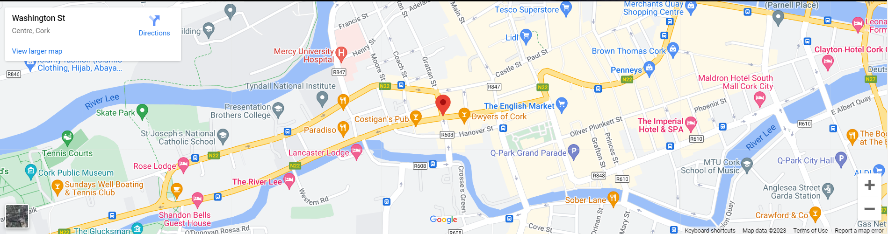
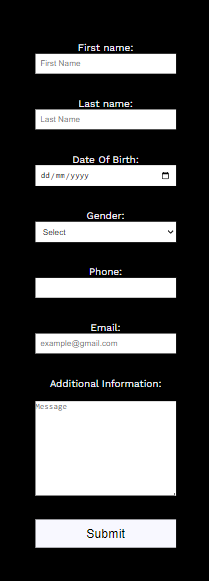
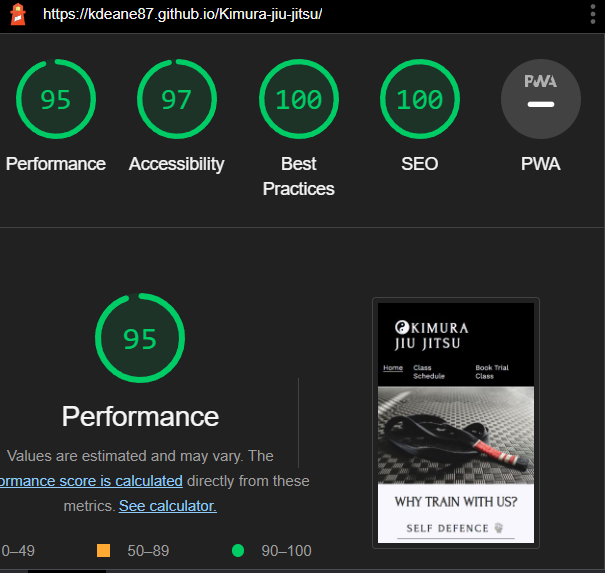
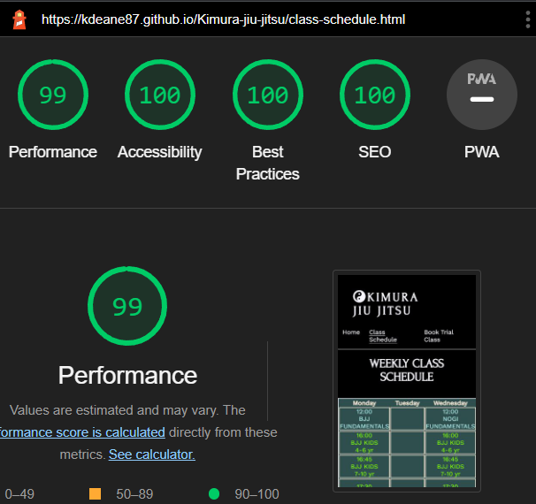
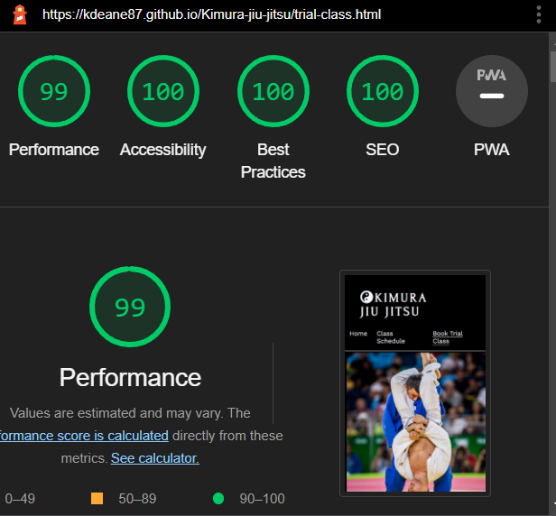

# Kimura Jiu Jitsu

This website was created as part of my Full Stack Diploma course. It is a website for a fictional Brazilian  Jiu Jitsu Gym located in Cork, Ireland. The aim of the website is to reach out to new members and to keep current members informed of class timetable and any other club information. 

## Features

**Navigation**

- Clicking on Home brings you to Home page.

- Clicking on Class Schedule brings you to Class Schedule page.

- Clicking on Book Trial Class brings you to booking form.

- The page you are currently on is highlighted with an underline ie if you are on home page then home will be underlined.

**Social Media Links**

- Clicking on the links in the footer will bring you to the corresponding social media platform.

**Map**

- Clicking on the map will open it up in a new page and give the option to get directions to the gym.

**Home Page**

- Gives a brief description of Jiu Jitsu with the use of text and imagary.

- Gives a brief description of what the club offers.

**Class schedule Page**

- Containes the weekly schedule of classes.

**Book Trial Class Page**

- Containes a form to contact the club with questions or too book in for a trial class.

- At the moment booking form is conected to code institute form dump (https://formdump.codeinstitute.net/). 

## Running Tests

**Html Validation**

1) Open up workspace in Gitpod.

2) Open index.html and copy all code.

3) Open https://validator.w3.org/ in seperate tab.

4) Click validate code by direct input.

5) Paste code.

6) Click check button and wait for results.

7) Repeat steps 2-6 for class-schedule.html and trial-class.html.

8) Fix any issues in Gitpod workspace and re-test.

**CSS Validation**

1) Open up workspace in Gitpod.

2) Open style.css found in the assets folder and copy all code.

3) Open https://jigsaw.w3.org/css-validator/ in a seperate tab.

4) Click validate code by direct input.

5) Paste code.

6) Click check button and wait for results.

7) Fix any issues in Gitpod workspace and re-test.

**Manual Testing**

Navigation

- Check that the menu is linked with the correct page.

- Upon checking everything was as expected.

Map

- Check that map opens up in a new tab and in the correct location.

- Upon checking everything was as expected.

Social Media Links

- Check that the links open in a new tab and is linked to the correct site.

- Upon checking everything was as expected.

Booking Form

- Check that form works as expected and links to https://formdump.codeinstitute.net/

- Upon checking everything was as expected.

- Update: https://formdump.codeinstitute.net/ seems to be down 31/03/2023.

**Lighthouse**

**Accessibility**

- All three pages were checked using https://wave.webaim.org/ and passed with no issues.

## Libraries and programmes

- Git for version control.

- Github to save and store the files for the website.

- Google Fonts to import the fonts used on the website.

- Font Awesome for the iconography on the website.

- Google Devoloper Tools to troubleshoot and test features, solve issues with responsiveness and styling

## Version control

**Git commands**

To push code from githod to github follow these instructions in the terminal;

1) git add .

2) Git commit -m "message about whats being added"

3) git push

## Deployment

The site was deployed to GitHub Pages.

1) Go to Github repo
2) Click on "Settings"
3) Click on "Pages"(tab on the left sidebar)
4) Scroll to "Build and deployment"/"Source" section
5) Find sub-section "Branch"
6) From drop-down manu "none"/"select branch" choose source "main" and folder "/root"
7) Click "Save"
8) Wait until you can see a link for deployed page within Github Page section, this can take a while and once the page updates you will see a message:
9) Your site is live at https://kdeane87.github.io/Kimura-jiu-jitsu/
 

